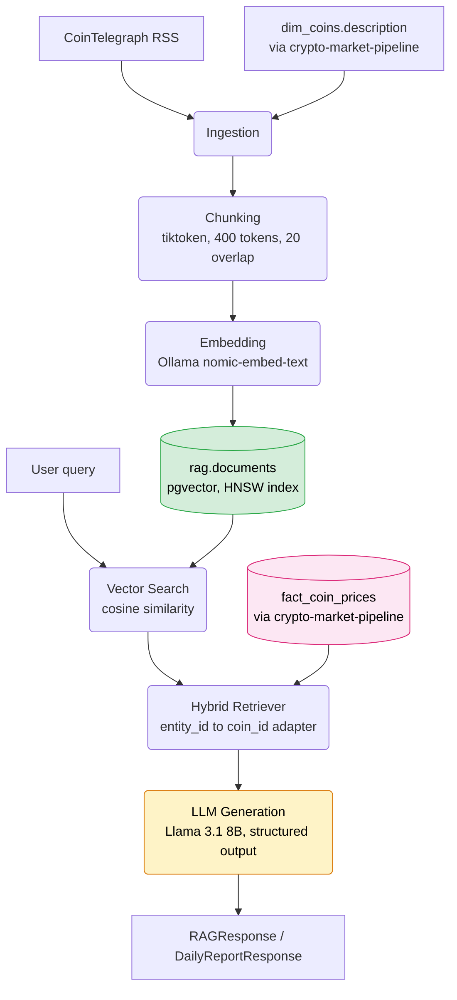

# crypto-market-rag

A Retrieval-Augmented Generation system for the crypto market. It combines vector similarity search over news and coin descriptions with exact structured price lookups, then generates answers with a local LLM. The model output is constrained so numbers never come from the model itself. This project reads from [`crypto-market-pipeline`](../crypto-market-pipeline)'s PostgreSQL database over a shared Docker network, orchestrated by its own Apache Airflow instance.

---

## Table of Contents

- [Overview](#overview)
- [Features](#features)
- [Architecture](#architecture)
- [Project Structure](#project-structure)
- [Tech Stack](#tech-stack)
- [Design Decisions](#design-decisions)
- [Installation](#installation)
- [Configuration](#configuration)
- [Running the System](#running-the-system)
- [Database Schema](#database-schema)
- [Testing](#testing)
- [Known Limitations](#known-limitations)
- [Troubleshooting](#troubleshooting)
- [License](#license)
- [Author](#author)

---

## Overview

Ask "how is bitcoin doing today" and the system pulls the actual current price from PostgreSQL, retrieves relevant recent news through vector search, and writes a summary grounded in both. The language model never invents the price. It only writes the sentence structure around it.

Each query runs through five stages:

1. **Ingestion.** Pull crypto news (RSS) and coin descriptions (read from the pipeline's database).
2. **Chunking.** Split long text into overlapping pieces of roughly 400 tokens each.
3. **Embedding.** Convert each chunk into a 768-dimension vector using Ollama's `nomic-embed-text`.
4. **Retrieval.** Run a vector similarity search (pgvector) combined with a structured SQL price lookup.
5. **Generation.** A local LLM (Llama 3.1 8B) writes the narrative, constrained to a JSON schema.

Two Airflow DAGs run this on a schedule. One ingests news and coin descriptions every six hours. The other generates a daily market report at 07:00.

---

## Features

- Hybrid retrieval: vector search for meaning, SQL for exact numbers, combined in one adapter module.
- Structured LLM output through Ollama's `format` parameter, generated from the same Pydantic schemas used everywhere else in the codebase. The model never returns free text that needs parsing after the fact.
- Numbers computed in SQL before the LLM runs. The model only ever writes narrative, never a number that ends up in a response.
- A generic ingestion and retrieval core with no knowledge of "coins." A single adapter file, `hybrid_retriever.py`, translates between the generic data model and the pipeline's `coin_id` schema.
- Its own Airflow instance, connected to the pipeline's PostgreSQL through a shared Docker network, read-only, through a dedicated least-privilege database role.
- 42 unit tests, 99% coverage on `rag_src/`.
- Reusable as a Poetry path dependency. [`crypto-telegram-bot`](../crypto-telegram-bot) imports `rag_src` directly, with no code duplication.

---

## Architecture



`crypto-market-pipeline` and `crypto-market-rag` share the same PostgreSQL instance, `crypto_postgres`. Two separate Docker Compose projects reach it over a shared network, `crypto_shared_net`. They do not share a container or share code.

---

## Project Structure

```
crypto-market-rag/
│
├── .github/
│   └── workflows/
│       ├── lint.yml                    ruff, mypy, pytest, runs on every push and PR
│       └── cd.yml                      builds and pushes a Docker image to ghcr.io after lint.yml succeeds
│
├── rag_src/                            (the reusable package, path-imported by crypto-telegram-bot)
│   ├── schemas/                         Pydantic contracts
│   │   ├── raw_document.py              generic ingestion output (entity_id/entity_type)
│   │   ├── rag_response.py              structured answer to a query
│   │   └── report_response.py           structured daily report
│   ├── ingestion/
│   │   ├── base.py                      BaseIngestionSource (ABC)
│   │   ├── news_scraper.py              CoinTelegraph RSS
│   │   └── coin_description.py          reads dim_coins.description, read-only
│   ├── embedding/
│   │   ├── chunker.py                   token-based chunking with overlap
│   │   ├── embedder.py                  Ollama embedding calls
│   │   └── indexer.py                   chunk, embed, and upsert into rag.documents
│   ├── retrieval/
│   │   ├── vector_search.py             generic pgvector similarity search
│   │   └── hybrid_retriever.py          the entity_id to coin_id adapter
│   ├── generation/
│   │   ├── llm_client.py                generic structured-output Ollama wrapper
│   │   ├── query_answer.py              builds a RAGResponse
│   │   └── report_generator.py          builds a DailyReportResponse
│   ├── cli/
│   │   └── main.py                      Typer CLI (query, report)
│   └── utils/
│       ├── config.py                    environment variable loader (pydantic-settings)
│       ├── logger.py                    structlog setup
│       └── observability.py             rag.ingestion_runs tracking
│
├── dags/
│   ├── news_ingestion_dag.py            every 6 hours
│   └── daily_report_dag.py              daily, 07:00
│
├── sql/
│   └── vector_schema.sql                pgvector extension, rag.documents, rag.ingestion_runs, rag_user
│
├── tests/                                pytest, one file per module
│
├── Dockerfile                            this project's own Airflow image
├── docker-compose.yml                    own Airflow (webserver, scheduler, metadata DB), port 8081
├── pyproject.toml                        packages = [{include = "rag_src"}], for path-dependency reuse
├── .pre-commit-config.yaml               ruff, mypy, and basic hygiene hooks, run locally before commit
└── .env.example
```

---

## Tech Stack

| Layer | Technology | Notes |
|---|---|---|
| Language | Python | 3.12 |
| Dependency management | Poetry 2.x | `rag_src` packaged for path-dependency reuse |
| Vector store | PostgreSQL + pgvector | Same database as `crypto-market-pipeline`, extended, not duplicated |
| Embedding model | `nomic-embed-text` (Ollama, local) | 768 dimensions |
| Chat model | `llama3.1:8b` (Ollama, local) | Chosen after checking available RAM, see Design Decisions |
| Orchestration | Apache Airflow 2.9.3 (TaskFlow API) | Own instance, separate from the pipeline's |
| Schema validation | Pydantic v2 | Used for both data contracts and LLM structured output |
| CLI | Typer + Rich | |
| Testing | pytest + pytest-mock | 42 tests, 99% coverage |
| Linting and types | ruff, mypy | Both run in CI and as pre-commit hooks |
| CI/CD | GitHub Actions | `lint.yml` runs ruff, mypy, and pytest on every push and PR. `cd.yml` builds and pushes a Docker image to `ghcr.io`, only after `lint.yml` succeeds |

---

## Design Decisions

A handful of decisions in this project came from testing something and finding the first plan did not hold up. Documenting the reasoning, including the reversals, matters more here than a clean narrative that skips them.

**Generic `entity_id` and `entity_type`, not `coin_id`.** The core schema, `RawDocument` and `rag.documents`, never mentions coins. Everything is expressed generically, so the same ingestion, embedding, and retrieval code could serve a different domain without a rewrite. Exactly one file, `hybrid_retriever.py`, knows that `entity_id` and the pipeline's `coin_id` are the same string for `entity_type="coin"`. That is the anti-corruption layer, kept deliberately narrow.

**Numbers from SQL, narrative from the LLM.** `DailyReportResponse.top_movers` is computed with a SQL window function, `ROW_NUMBER() OVER (PARTITION BY coin_id ...)`, never asked from the LLM. The model only gets a smaller internal schema (`_ReportNarrative`: summary and sentiment) to fill in. A regression test enforces this directly. It asserts that `"top_movers"` never appears in the schema sent to the LLM.

**HNSW over IVFFlat for the vector index.** HNSW needs no training pass and gives better accuracy at the row counts this project runs at, thousands to tens of thousands. IVFFlat starts to make sense past a few million rows, which this dataset will not reach.

**Chunking with overlap, sized by tokens.** Word or character counts do not match what the embedding model actually processes. Chunks run roughly 400 tokens, measured with `tiktoken` as a length proxy (its tokenizer is not the same as `nomic-embed-text`'s internal one), with 20 tokens of overlap. A sentence that would otherwise get cut at a chunk boundary still appears whole in at least one chunk.

**Llama 3.1 8B over Mistral Small 3.2.** The guide this project follows named both as candidates. `nvidia-smi` came back empty: no discrete GPU, so inference runs on CPU. Available RAM at the time measured around 9.6GB. Mistral Small 3.2 needs roughly 12GB; Llama 3.1 8B needs roughly 6GB. The number decided this one, not a preference.

**`rag_src`, not `src`.** `crypto-market-pipeline`'s own Airflow container mounts a `src/` folder. Running both projects' code in the same Airflow process, with two top-level packages both named `src`, risks Python resolving an import to the wrong project's code. The collision would not raise an error. It would just silently return whichever `src` got imported first. The rename happened before that became a live bug instead of a theoretical one.

**Its own Airflow instance, reversed from an earlier plan.** The first working version ran this project's DAGs inside `crypto-market-pipeline`'s existing Airflow container, saving the cost of a second Postgres, webserver, and scheduler stack. It worked, but it meant the pipeline's `Dockerfile`, meant to read as pure data engineering, carried `psycopg[binary]`, `ollama`, `feedparser`, and `beautifulsoup4` as dependencies with no data-engineering purpose. Once that mismatch got flagged, the setup reverted to a fully separate Airflow instance: its own metadata Postgres, port 8081, connected to the shared `crypto_postgres` over `crypto_shared_net`. The pipeline's `Dockerfile` went back to only what data engineering needs.

---

## Installation

### Prerequisites

| Requirement | Version | Notes |
|---|---|---|
| Docker + Docker Compose | 24.0+ / 2.20+ | |
| Poetry | 2.x | Path-dependency syntax used here requires 2.x |
| Ollama | any recent | Running locally, not containerized |
| `crypto-market-pipeline` | | Must be running first, see below |

### Step-by-Step Setup

**1. Start `crypto-market-pipeline` first.**

This project's `docker-compose.yml` references `crypto_shared_net` as `external: true`. The pipeline's compose file creates that network, so the pipeline needs to be up before this project's containers can start.

**2. Clone, sitting next to `crypto-market-pipeline`.**

```bash
git clone git@github.com:gladytdavianus/crypto-market-rag.git
cd crypto-market-rag
```

Both projects read from paths relative to each other (`../crypto-market-pipeline`, `../crypto-market-rag`). Keep them as sibling folders.

**3. Configure environment variables.**

```bash
cp .env.example .env
python3 -c "import secrets; print(secrets.token_hex(16))"
```

Paste the generated secret into `AIRFLOW__WEBSERVER__SECRET_KEY`. Fill in `POSTGRES_PASSWORD` (the `rag_user` role's password, created in step 5) and `OLLAMA_HOST`.

**4. Install dependencies and pull models.**

```bash
poetry install
ollama pull nomic-embed-text
ollama pull llama3.1:8b
```

**5. Apply the database schema.**

```bash
docker exec -i crypto_postgres psql -U crypto_user -d crypto_market_db < sql/vector_schema.sql
```

This creates the `rag` schema, `rag.documents`, `rag.ingestion_runs`, and the `rag_user` role. That role gets read-only access to the pipeline's `dim_coins` and `fact_coin_prices`, and full read-write access to the `rag` schema.

**6. Build and start this project's Airflow instance.**

```bash
docker compose build
docker compose up -d
```

---

## Configuration

### Environment Variables (`.env`)

| Variable | Description |
|---|---|
| `POSTGRES_HOST` | `localhost` for local Poetry runs, `crypto_postgres` inside Docker |
| `POSTGRES_PORT` / `POSTGRES_DB` | `5432`, matches the pipeline's database name |
| `POSTGRES_USER` / `POSTGRES_PASSWORD` | `rag_user` and its password |
| `OLLAMA_HOST` | `http://localhost:11434` locally, `http://host.docker.internal:11434` inside Docker |
| `OLLAMA_EMBEDDING_MODEL` | `nomic-embed-text` |
| `OLLAMA_CHAT_MODEL` | `llama3.1:8b` |
| `AIRFLOW__WEBSERVER__SECRET_KEY` | Random secret, must differ from the pipeline's own |
| `AIRFLOW_UID` | Host user ID, see Troubleshooting item 4 |

---

## Running the System

### CLI (manual queries)

```bash
poetry run python -m rag_src.cli.main query "how is bitcoin doing today"
poetry run python -m rag_src.cli.main report
```

### Scheduled (Airflow)

Open `http://localhost:8081` (login: `admin` / `admin`). This is a separate UI from `crypto-market-pipeline`'s, which runs at `:8080`.

```bash
docker exec -it $(docker ps -qf "name=airflow-scheduler") \
  airflow dags trigger news_ingestion_dag

docker exec -it $(docker ps -qf "name=airflow-scheduler") \
  airflow dags trigger daily_report_dag
```

`news_ingestion_dag` runs two independent tasks in parallel: news RSS and coin descriptions. Each logs its status to `rag.ingestion_runs`. `daily_report_dag` writes its output to `data/daily_reports/{date}.json`.

---

## Database Schema

**`rag.documents`.** One row per chunk, not per document.

| Column | Type | Description |
|---|---|---|
| `entity_id` / `entity_type` | TEXT | Generic reference. `coin_id` only when `entity_type='coin'`; a hash of the URL for news |
| `title`, `content` | TEXT | Chunk content, not the full source document |
| `source_name`, `chunk_index` | TEXT, INTEGER | Which source, and which chunk of that source's document |
| `embedding` | vector(768) | HNSW-indexed, cosine distance |
| `metadata` | JSONB | Domain-specific fields, kept out of the core schema |

`UNIQUE (entity_id, source_name, chunk_index)` turns re-indexing the same document into an upsert instead of a duplicate insert.

**`rag.ingestion_runs`.** One row per scheduled ingestion run, for observability: `source_name`, `status`, `documents_fetched`, `chunks_created`, `error_message`.

---

## Testing

```bash
poetry run python -m pytest -v
poetry run ruff check .
poetry run ruff format --check .
poetry run mypy -p rag_src
```

Note: `poetry run pytest` on its own fails with `ModuleNotFoundError: No module named 'rag_src'`. It does not add the project root to `sys.path`. Use `python -m pytest`, not bare `pytest`. `mypy` needs `-p rag_src` (package mode) rather than `mypy rag_src/`, or it raises "Source file found twice under different module names" once `crypto-telegram-bot` is installed as a path dependency alongside it.

42 tests span 10 files, one per source module. A few worth calling out:

- `test_generate_daily_report_numbers_come_from_sql_not_llm` asserts that `top_movers` never appears in the JSON schema sent to the LLM.
- `test_retrieve_context_only_queries_prices_for_coin_entities` asserts that a news article's `entity_id` never reaches the price-lookup query.
- `test_query_command_prints_answer_and_sources` is a regression test for a `rich` markup bug, see Troubleshooting item 6.

All four commands above run on every push and pull request through `.github/workflows/lint.yml`. `.github/workflows/cd.yml` runs after, and only builds and pushes the Docker image if `lint.yml` passed, so a broken commit never reaches the image registry. `.pre-commit-config.yaml` runs ruff and mypy locally before each commit, catching most of this before it ever reaches CI.

---

## Known Limitations

- **Ollama's default rate limit** sits under 10 requests per second. That is fine for one user, not for concurrent traffic. `vLLM` is the upgrade path if that changes.
- **CPU-only inference.** No discrete GPU on the development machine. Generation takes tens of seconds per query.
- **RSS-only news.** No paid news API, so coverage depends on what CoinTelegraph's public feed carries.
- **Two full Airflow stacks running for two DAGs total.** The own-instance decision bought back a clean separation between this project and the pipeline. See Design Decisions.

---

## Troubleshooting

### 1. `psycopg.errors.UndefinedFile: could not access file "$libdir/vector"`

**Cause:** `pgvector` installed manually with `apt-get install postgresql-16-pgvector` inside a running container does not survive `docker compose down` followed by `up`. The container gets recreated from the base image, and the manually installed package is gone. Postgres still remembers the extension was created, since that record lives in the database on the persistent volume, but it can no longer find the library file backing it.

**Solution:** Use the `pgvector/pgvector:pg16` image instead of `postgres:16` plus a manual `apt-get install`. It is a drop-in replacement with pgvector already compiled in, so it survives container recreation.

---

### 2. `operator does not exist: vector <=> double precision[]`

**Cause:** `pgvector.psycopg.register_vector(conn)` is supposed to teach psycopg how to adapt Python lists to Postgres's `vector` type automatically. It adapted the value fine for `INSERT`, since Postgres has an implicit cast from array to vector for column assignment, but not for the `<=>` operator used in `ORDER BY`. Operator resolution does not pick up that implicit cast the same way.

**Solution:** Stop relying on `register_vector()`. Format the embedding as pgvector's text literal (`"[0.1,0.2,...]"`) directly, and cast explicitly in SQL: `embedding <=> %s::vector`. This works regardless of psycopg or pgvector package versions.

---

### 3. `pyproject.toml changed significantly since poetry.lock was last generated`

**Cause:** Adding a dependency by editing `pyproject.toml` directly, instead of running `poetry add`, leaves `poetry.lock` out of sync.

**Solution:** Run `poetry lock` before `poetry install`.

---

### 4. `PermissionError: [Errno 13] Permission denied: '/opt/airflow/logs/scheduler'`

**Cause:** A `logs/` folder created by an earlier `docker compose build` attempt ended up owned by `root`. The Airflow container runs as UID 50000, or the host user if `AIRFLOW_UID` is set, and cannot write to a root-owned directory.

**Solution:**
```bash
sudo chown -R $USER:$USER logs
chmod -R 777 logs data
```

---

### 5. Poetry 2.x: `Either [project.name] or [tool.poetry.name] is required in package mode`

**Cause:** Mixing the legacy `[tool.poetry]` metadata style with `package-mode = false` triggers this error in Poetry 2.x, even when a name is present elsewhere in the file.

**Solution:** Migrate to the PEP 621 `[project]` table for name, version, and dependencies. Keep `[tool.poetry]` only for `package-mode`, later `packages = [...]` once this project became a path dependency for `crypto-telegram-bot`, and dev dependency groups.

---

### 6. `rich` console silently drops `[text]` written in bracket notation

**Cause:** `rich.Console.print()` treats `[...]` as markup syntax for style tags, not literal text. `console.print(f"- [{source['type']}] {title}")` renders the title with the bracketed part stripped, because `rich` reads `[news_article]` as an unrecognized style tag and drops it instead of displaying it.

**Solution:** Use parentheses instead of square brackets for anything that is not meant to be `rich` markup: `f"- ({source['type']}) {title}"`.

---

### 7. `zip()` without `strict=True` hides length mismatches

**Cause:** `dict(zip(columns, row))`, used to turn a `psycopg` cursor's raw tuple results into named dictionaries, silently truncates to the shorter of the two sequences if `columns` and `row` ever end up different lengths, for example after schema drift. No error, just quietly wrong data.

**Solution:** Add `strict=True` to every `zip()` used this way. A length mismatch now raises immediately instead of producing a dictionary missing a field.

---

### 8. CoinDesk RSS feed returns empty `content` and `summary`

**Cause:** CoinDesk's public RSS feed carries headlines and tags only. The `summary` and `content` fields both come back as empty strings for every entry. This surfaced only after chunking and embedding produced zero chunks for stored "articles" that had no actual text.

**Solution:** Switch the default feed to CoinTelegraph's RSS, which carries a full HTML summary. Add `_strip_html()`, using BeautifulSoup, to convert that HTML into plain text before chunking.

---

### 9. Database collation version mismatch after switching Postgres images

**Cause:** Switching `postgres_crypto`'s image from `postgres:16` to `pgvector/pgvector:pg16` (see item 1) changed the underlying OS collation library version. Postgres flags this as a warning on every connection.

**Solution:**
```sql
ALTER DATABASE crypto_market_db REFRESH COLLATION VERSION;
```

---

## License

MIT. See the [LICENSE](LICENSE) file.

---

## Author

**Glady T. Davianus**, Instrument and Control Engineer transitioning into Data Engineering.

GitHub: [https://github.com/gladytdavianus](https://github.com/gladytdavianus)

Issues and pull requests are open.

---

*Last updated: August 19, 2026*
